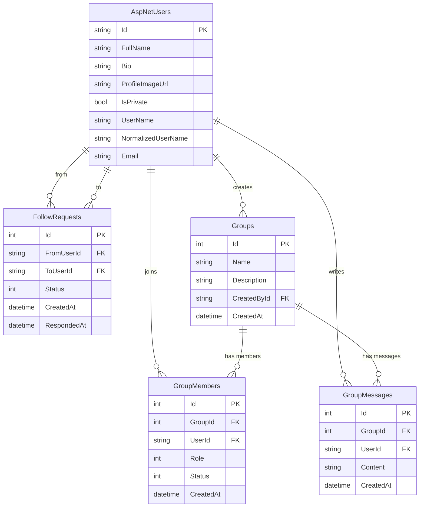

# Connectly - a micro-social platform developed in .NET 

>[!warning]
> Still in development.

## Setup 

Clone the repo 

```
git clone https://github.com/stefanchp/Connectly.git && cd Connectly
```

Create the docker container and run the configuration. 

```
docker compose up -d
```

Setup an `.env` file:

```
cp .env.example .env
```

And then setup a `DB_PASSWORD` in `.env` and connect with a connection string in `appsettings.Development.json`.

To update the database run:

```
dotnet ef database update
```

## Database Diagram


