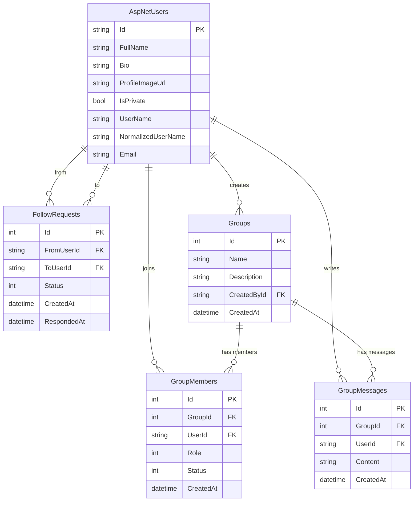

# Connectly - a micro-social platform developed in .NET 

>[!warning]
> Still in development.

## Local setup (fresh clone)

1) Clone and enter the repo  
```bash
git clone https://github.com/stefanchp/Connectly.git
cd Connectly
```

2) Configure environment  
```bash
cp .env.example .env   # set DB_PASSWORD inside
```

3) Start SQL Server in Docker  
```bash
docker compose up -d db
```

4) Apply migrations (creates the schema and seeds users/groups)  
```bash
dotnet ef database update
```

5) Run the app  
```bash
dotnet run
```

Seeded accounts (for testing):
- admin@test.com / Admin1! (Admin)
- maria@example.com / User1!
- andrei@example.com / User2!

## Database Diagram


